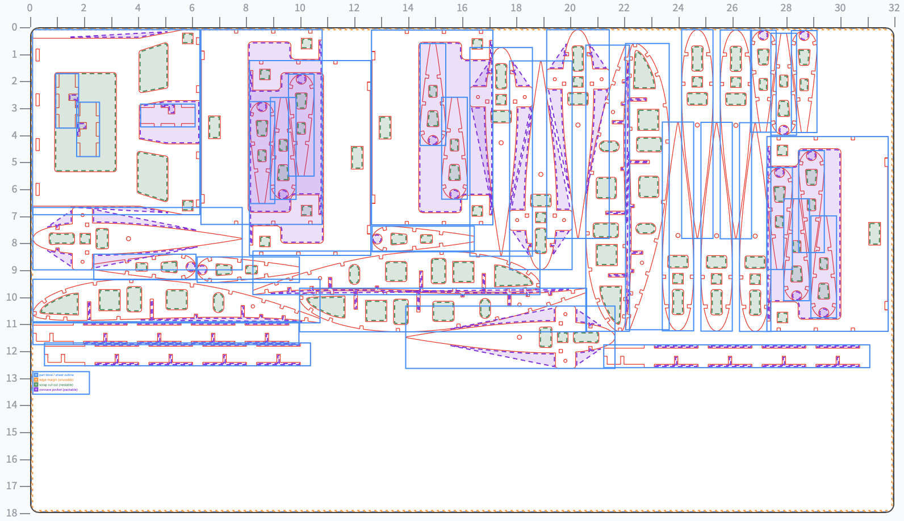
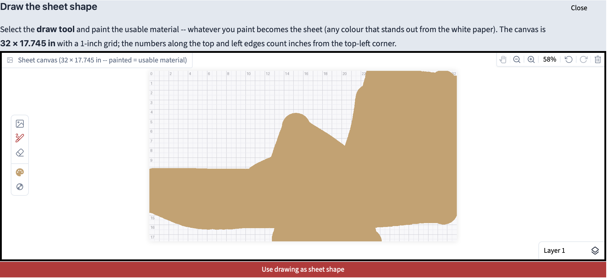
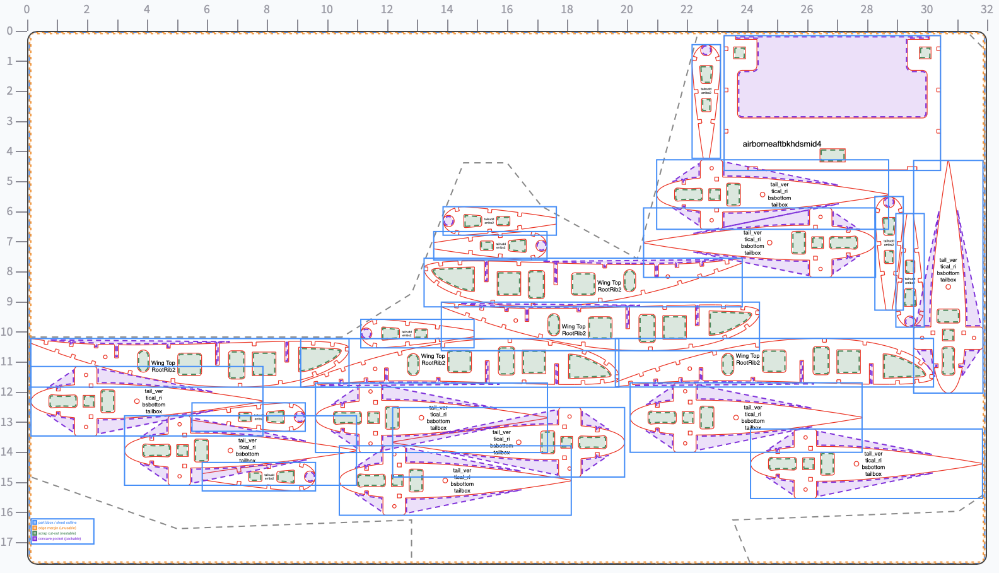

# BalsaNest
BalsaNest arranges part drawings on wood sheets. It packs parts closely to reduce waste, keeps each part's
grain orientation where you specify it, engraves part names, and writes SVG files. All dimensions
are in inches.

  <figure style="text-align: center;">
    
    <figcaption><em>Example of a nested sheet produced by BalsaNest.</em></figcaption>
  </figure>

### Why grain matters

Wood is much stronger along the grain than across it, especially balsa,
where a rib cut in the wrong orientation snaps under light load. General purpose nesting tools
like [SVGNest](https://github.com/Jack000/SVGnest) and [Deepnest](https://github.com/Jack000/Deepnest) have no per-part grain control. BalsaNest
treats grain as a hard constraint, a part marked *parallel* or
*perpendicular* is only ever placed in orientations that satisfy it. For
plywood parts, where grain direction rarely matters, mark them *free* and
they pack with full rotation freedom.

## Highlights

---

- **Easy to use** — drag and drop your CAD exports straight into the browser
  and press Start.
- **No Inkscape needed** — SVG, DXF, and PDF are read directly, no conversion
  step or manual cleanup.
- **Auto watermark removal** — SolidWorks educational watermarks are stripped
  automatically, and multi-view exports are collapsed to a single part.
- **No stroke fiddling** — cut colours and hairline widths are already set to
  standard laser conventions in the output files.
- **Grain-safe by construction** — a part marked *parallel* or
  *perpendicular* can never end up rotated the wrong way.
- **Wastes less wood** — small parts are nested inside the cut-out windows of
  bigger ones, and odd-shaped offcuts can be used by drawing or uploading
  their outline.
## Features

---

- **Three input formats: SVG, DXF, and PDF** — 
  SolidWorks's PDFs exports have the educational
  watermark stripped automatically. DXFs get their units read from the file
  (with a per-part override if a drawing was saved without them). Multi-view
  exports are collapsed to a single copy of the part, and CAD segments
  are stitched back into closed shapes so material and holes are detected correctly. 

- **Grain control per part** — *parallel*, *perpendicular*, or *free*, plus
  the angle of your drawing's grain reference if it isn't horizontal.
  Mirroring is grain preserving, and mirrored variants are only added when
  they're genuinely different, that is, a symmetric rib isn't being packed, while a cambered airfoil gains a whole extra orientation.

- **Tight packing** — parts hug each other's true outlines not  bounding boxes. Every part is then slid toward the corner into the tightest reachable
  spot, small parts are dropped inside the waste cutouts of bigger parts, and concave pockets get filled too.

- **Two optimizers**,
  - *Heuristic optimization (fast)* — the **order** parts are placed in
    decides the layout, so the whole job is packed several times with
    different orders: biggest first, longest first, narrowest first, then
    randomized variations, stopping early once improvements dry up. A final
    polish pass pulls each placed part back out and re-places it with full
    knowledge of the finished layout, letting parts migrate into pockets that
    only opened up later.
  - *Genetic algorithm (slow but tighter)* — It starts from the heuristic's own best orders (so it can only match
    or beat them), then repeatedly breeds new orders by splicing two good
    parents together, adds random swap mutations, and keeps the fittest of
    each generation. Already tried orders are remembered.

- **Odd-shaped stock** — nest onto a non-rectangular offcut by uploading its
  outline drawing or painting its shape on a canvas. Interior holes count as blocked areas, the edge margin
  follows the outline, and parts tuck into its slanted corners.

  <figure style="text-align: center;">
    
    <figcaption><em>Define the usable area of the sheet directly on the canvas.</em></figcaption>
  </figure>

  <figure style="text-align: center;">
    
    <figcaption><em>Parts are placed only within the defined usable area.</em></figcaption>
  </figure>

- **Smart part labels placement to keep raster time short.** Lasers raster
  horizontally and reposition slowly in the vertical direction.
  - text is **always horizontal** — vertical engraving is never emitted;
  - each label may **slide up or down inside its part** to land on a shared
    row with its neighbours, so several labels engrave in one head pass (two
    copies of the same part can carry their labels at different heights if
    that lines each up with a different neighbour);
  - labels sharing a row are **pulled toward each other** to shorten the
    sweep, but labels on **opposite ends of the sheet never share a row**.
  - the label is anchored at the **deepest point inside the part** and its
    font grows only while the whole text block stays within the material.
  - long names **wrap on word boundaries** onto up to four lines; single words
    are never chopped mid-word;
  - parts genuinely too small for a legible name are left blank.
  - choose **solid raster letters** (bold) or **traced outline letters**.
  - 
- **Hairline and fixed-width cut lines** — choose hairline strokes or set an exact line width in pixels or inches.

- **Common-line merging** — when spacing is set to zero, shared edges between touching parts are merged so the laser cuts the edge once instead of twice.

- **Inkscape-ready grouping** — every part and its label are placed in a single Inkscape group, so manual layout adjustments move the geometry and label together.

## Install

---

You need **Python 3.10 or newer** ([python.org](https://www.python.org/downloads/)).
Open a terminal in the BalsaNest folder, then:

### Windows (PowerShell)

```powershell
python -m venv .venv
.venv\Scripts\Activate.ps1
python -m pip install -r requirements.txt
```

### macOS / Linux

```bash
python3 -m venv .venv
source .venv/bin/activate
python -m pip install -r requirements.txt
```

## Usage

---

Start the app (Windows users can just double-click `run_webui.bat`):

```bash
python webui.py
```

Your browser opens at `http://127.0.0.1:7860`. 

### Parts

Drop your SVG/DXF/PDF files into the Parts section. Each file becomes a card
showing a preview and its measured size — **check the size looks right** before
anything else. On each card:

- **Quantity** — how many copies to cut.
- **Grain alignment** — *parallel* (part grain follows the sheet grain, the
  strong choice for ribs and spars), *perpendicular* (across the grain), or
  *free* (any 90° rotation allowed — fine for gussets and doublers). 
- **Grain direction in the drawing** — if your drawing's grain reference isn't
  horizontal, enter its angle here (parallel/perpendicular only).

### Sheet of material

- **Width / Height** 
- **Custom sheet shape** — for offcuts and odd shapes: press *Draw the sheet
  shape...* and paint the usable material on a canvas, or upload an
  outline drawing. Parts are then only placed inside that shape, and interior
  holes are treated as unusable.
- **Grain direction of the sheet** — which way the grain runs on your stock
  (x = along the width, y = along the height).
- **Maximum number of sheets** — 0 lets BalsaNest add sheets as needed.
- **Edge margin** — border where nothing is placed.
- **Spacing between parts** — minimum gap between neighbouring cuts.

### Nesting algorithm settings

- **Optimizer**:
  - *Heuristic optimization (fast)* — tries several sensible packing orders
    (biggest-first, longest-first, and randomized variations) and keeps the
    best. 
  - *Genetic algorithm (slow but tighter)* — It can only match or beat the heuristic, but each
    generation takes real time on big jobs. Press **Stop evolving** whenever
    you're happy, or let it stop at *Maximum generations*.
- **Optimization passes / Maximum generations** — how long the chosen
  optimizer works.
- **Allow parts to be flipped (mirrored)** — mirror images pack tighter; turn
  off if parts have a "good" face.
- **Nest small parts inside cut-outs** — use the waste inside lightening holes.
- **Keep a partial result** — if not everything fits, still get the sheets
  that do.
- **Advanced finetuning** — search-grid and curve-sampling resolution, and the
  random seed.

### Output & laser settings

- **Engrave each part's name** — on/off, plus *raster* (solid letters) vs
  *outline* (traced letters, much faster) styles.
- **Colours** — cut, raster-label, and outline-label colours to match laser software's conventions.
- **Cut line style** — Hairline or a fixed width in pixels or inches.
- **Merge common cut lines** — with part spacing set to 0, an edge shared by
  two touching parts is cut once instead of twice.
- **Debug overlay in the downloaded file** — adds the inspection layer to the
  SVG itself.

### Running it

Press **Start**. The visualizer streams the layout live under a status banner. When it
finishes, the Output section holds your files.

### Without the browser

- **Terminal CLI**: `python balsanest.py`
- **Saved job file**: `python balsanest.py --config examples/example_job.json`

## Using the output

---

You get one SVG per sheet plus a JSON summary:

- **Open the SVG in Inkscape first.** Each part is a **group** containing its
  cut paths and its name label. Click a part and you can move or delete the
  whole thing, label included, if you want to hand-tweak the layout.
- **Colours are the laser conventions**: red hairlines = cut, black filled
  text = raster engrave, blue hairlines = outline engrave.
- The files are **exact 1:1 scale** (the document is set up in inches).
  Measure one part with Inkscape's tool the first time and confirm your laser
  software imports at 100%.
- The **JSON summary** lists every placement (position, rotation, mirrored or
  not, which cut-out it was nested into) and the material utilization per
  sheet — handy for records or scripting.

## How it works

---

Every internal technical detail is documented in `balsanest_core/README.md`.

## Notes

---

- Nesting results are very good but **not mathematically
  optimal**. Re-running with a different random seed, more passes, or the
  genetic algorithm often squeezes out a bit more.
- The genetic algorithm's **first update takes the longest** (it must evaluate
  a whole starting population before generation 1 appears).
- PDF import uses **page 1 only**, export one part per PDF.
- Parts too small to hold a readable label are left unlabelled and reported.
- Common-line merging only merges **exactly** coinciding edges, so it needs
  part spacing 0, partial overlaps are left alone.
- A part drawn multiple times in one file (multi-view export) is detected and
  reduced to a single copy.
- Settings you use every time (sheet size, colours, stroke style) can be saved
  once in `balsanest_defaults.json`, both the web UI and the CLI pick them
  up automatically.
