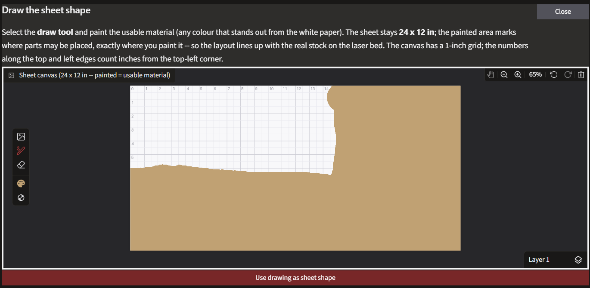
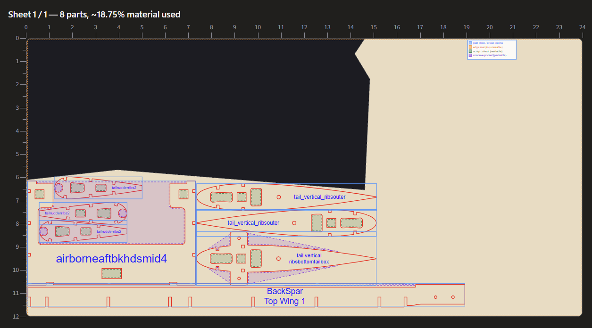
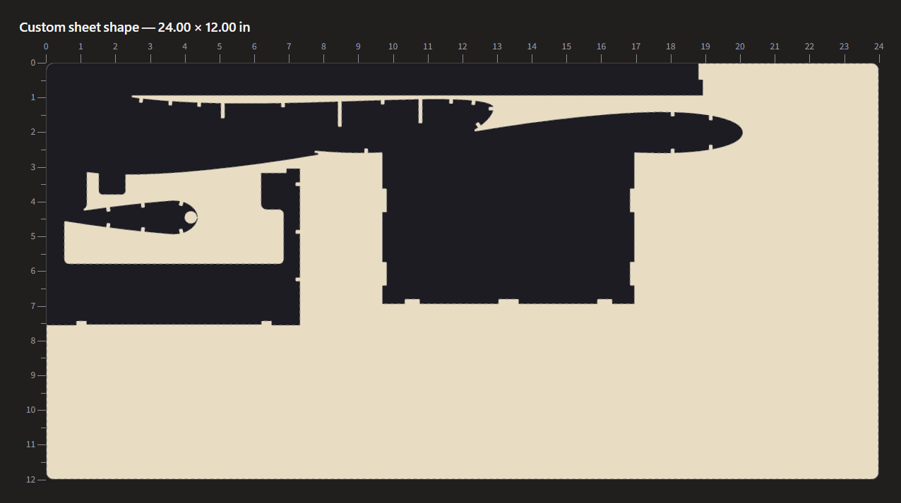
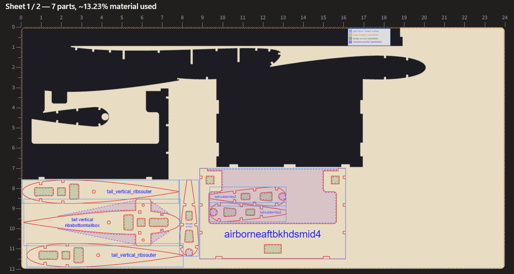
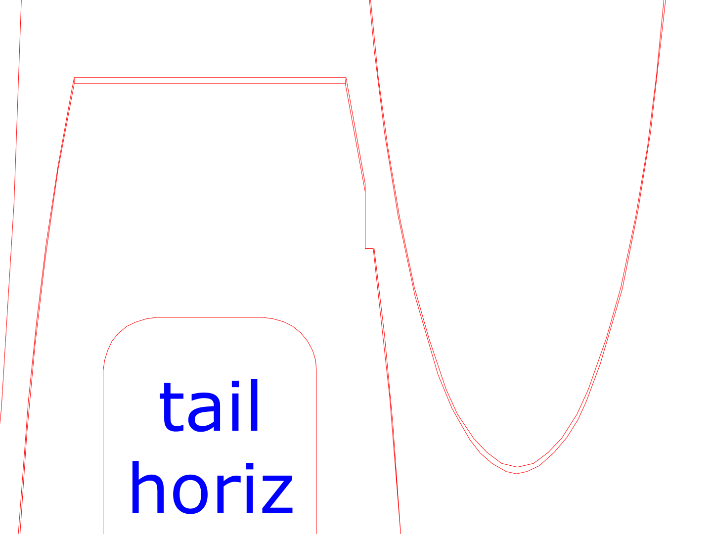
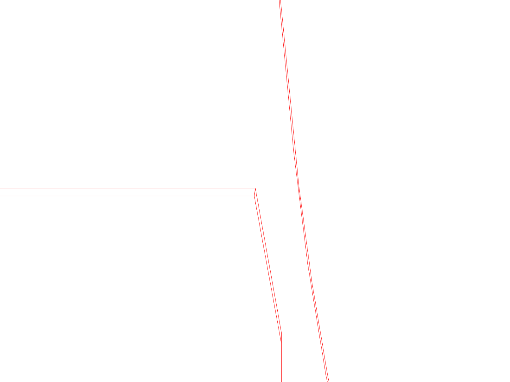
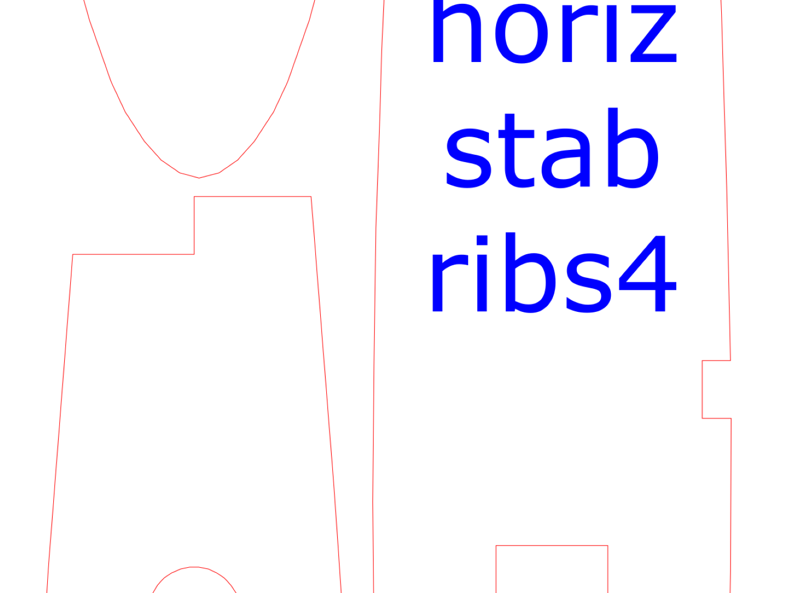
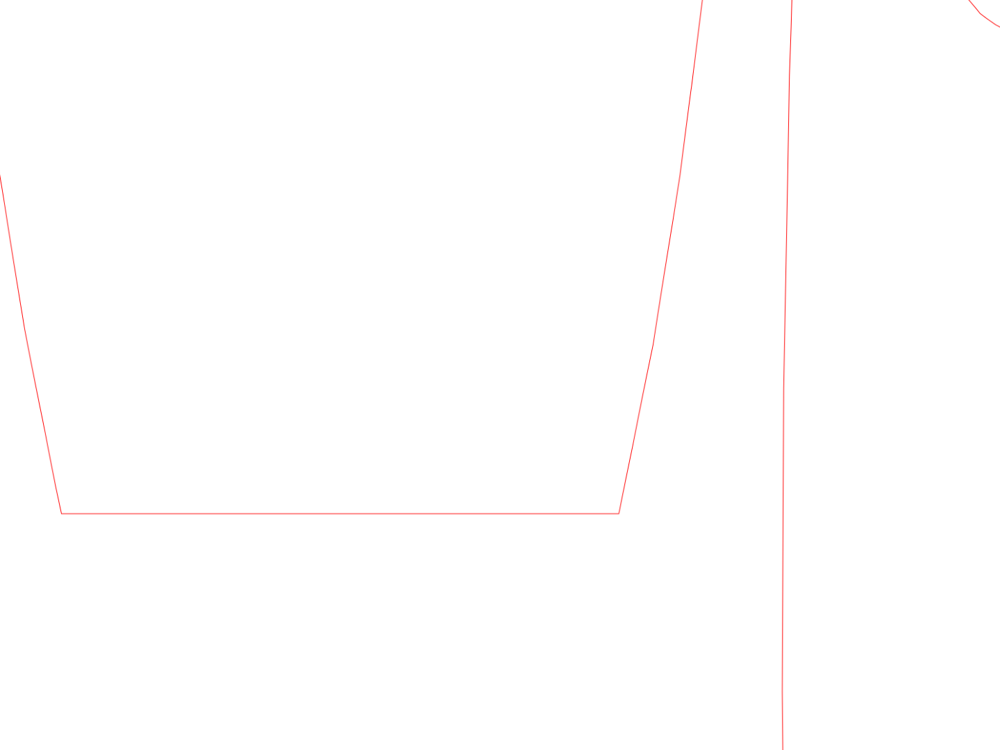

<p align="center">
  
</p>

# BalsaNest

BalsaNest arranges part drawings on wood sheets. It packs parts closely to reduce waste, keeps each part's
grain orientation where you specify it, engraves part names, and writes SVG files. All dimensions
are in inches.

Developed by [Scaven X](https://github.com/scavenx) at RU Airborne.

<p align="center">
  
  <br>
  <em>BalsaNest user interface, with a nesting layout generated by the algorithm.</em>
</p>

### Why grain matters

Wood is much stronger along the grain than across it, especially balsa,
where a rib cut in the wrong orientation snaps under light load. General purpose nesting tools
like [SVGNest](https://github.com/Jack000/SVGnest) and [Deepnest](https://github.com/Jack000/Deepnest) have no per-part grain control. BalsaNest
treats grain as a hard constraint, a part marked *parallel* or
*perpendicular* is only ever placed in orientations that satisfy it. For
plywood parts, where grain direction rarely matters, mark them *free* and
they pack with full rotation freedom.

## Feature highlights


- **Easy to use** — drag and drop your CAD exports straight into the browser
  and press Start.

- **Multi File Format Support** — SVG, DXF, and PDF are read directly, no conversion
  step or manual cleanup. DXFs get their units read from the file (with a
  per-part override if a drawing was saved without them), and CAD segment
  soup is stitched back into closed shapes so material and holes are
  detected correctly.

- **Auto watermark removal** — SolidWorks educational watermarks are stripped
  automatically, and multi-view exports are collapsed to a single part.


- **Grain-safe by construction** — *parallel*, *perpendicular*, or *free* per
  part, plus the angle of your drawing's grain reference if it isn't
  horizontal. A constrained part can never end up rotated the wrong way.
  Mirroring is grain preserving, and mirrored variants are only added when
  they're genuinely different, that is, a symmetric rib isn't being packed
  twice, while a cambered airfoil gains a whole extra orientation.

- **Tight packing** — parts hug each other's true outlines not  bounding boxes. Every part is then slid toward the corner into the tightest reachable
  spot, small parts are dropped inside the waste cutouts of bigger parts, and concave pockets get filled too. The finished cluster is anchored at the
  sheet's margin corner, so the layout always starts at the top left and the
  offcut stays one predictable piece.

- **Odd-shaped stock** — nest onto a non-rectangular offcut by uploading its
  outline drawing or painting its shape on a canvas. Interior holes count as blocked areas, the edge margin
  follows the outline, and parts tuck into its slanted corners. The shape stays
  exactly where it was drawn — the canvas keeps its full size and an uploaded
  file keeps its page size — so the layout lines up with the real stock on the
  laser bed.
  
<br>

<div align="center">
  
  
  <br>
  <em>Brush directly on the canvas to mark the usable sheet area. Parts are placed only within the selected region.</em>
</div>

<br>

- **Scrap reuse** — after a nest, the leftover material of each sheet is
  exported as an outline drawing at the sheet's true page size
  (`nest_scrap*.svg`). Upload it as the custom sheet shape next time and new
  parts nest straight onto the offcut, positioned to match the board.

<div align="center">
  
  
  <br>
  <em>Upload a scrap cutout generated by BalsaNest from a previous nesting session to reuse leftover material. Parts are nested only within the remaining usable area.</em>
</div>

<br>

- **Dimensionally exact parts** — kerf compensation: set the width your beam
  burns away and every cut line is offset outward by half of it (part
  outlines grow, holes shrink), so finished parts match the drawing exactly.
  Holes or slots narrower than the kerf can't survive the offset — they're
  detected and reported instead of silently vanishing.

- **Cut order that saves laser time** — within each part, holes are always cut
  before the outline that would free the part to shift; across the sheet,
  parts are cut in a nearest-neighbour order starting at the origin so the
  head travels less between parts.

- **Deplicate-contour repair** — a tapered part (a wing or stabiliser rib whose
  two faces differ) exported from its 3D body carries *both* face outlines. Every contour 
  is drawn twice, which reads as a hairline ring of material with the whole part as a "hole" and every real
  cutout inverted. Lines that close together are welded into one, keeping the
  outer contour of each pair, so the part comes out at its larger face.

<br>
<div align="center">
  
  
  <br>
  <em>Before welding: duplicated contours from the original export.</em>
</div>

<br>

<div align="center">
  
  
  <br>
  <em>After welding: duplicate contours merged into a single cut path.</em>
</div>
<br>


- **Save and load jobs** — one file bundles the part drawings themselves plus
  quantities, grain settings, the sheet, any custom shape, and every nesting
  and laser setting. Load it later and pick the project up without uploading
  anything again.

- **Smart part labels with custom fonts** — each part's name is engraved at the largest font
  that fits inside its material, wrapping long names onto multiple lines and
  skipping parts too small for a legible label. Labels stay horizontal and
  slide onto shared raster rows with their neighbours, so the laser makes
  fewer slow vertical moves. Choose raster or outline engraving, in any font
  installed on the machine.

- **Cuts-only twin files** — alongside the labelled output, a second SVG per
  sheet holding just the cut lines, for re-cutting a part without sitting
  through the engraving pass again.
  
- **Ready-to-cut output** — laser-convention colours at exact 1:1 scale, with
  hairline strokes or a fixed cut-line width in pixels or inches.

- **Common-line merging** — when spacing is set to zero, shared edges between touching parts are merged so the laser cuts the edge once instead of twice. With kerf compensation on, set the spacing equal to the kerf instead: both offset lines then land on the gap's midline and merge, and both parts still come out exact.

- **Inkscape-ready grouping** — every part and its label are placed in a single Inkscape group, so manual layout adjustments move the geometry and label together.

## Download and Run

Download a ready to run build from the
[Releases](https://github.com/RU-Airborne/BalsaNest/releases) page for Windows and macOS. 
Unzip, keep `balsanest_defaults.json` next to the executable,
and run it. The browser opens on its own. On macOS, the first launch is
blocked, right click the file, choose Open, and confirm.

## Run from Source Code

To run from source instead, you need **Python 3.10 or newer** ([python.org](https://www.python.org/downloads/)).
Open a terminal in the BalsaNest folder, then:

### Windows (PowerShell)

```powershell
python -m venv .venv
.venv\Scripts\Activate.ps1
python -m pip install -r requirements.txt
```

### macOS / Linux

```bash
python3 -m venv .venv
source .venv/bin/activate
python -m pip install -r requirements.txt
```

## Usage


Start the app (Windows users can just double-click `run_webui.bat`):

```bash
python webui.py
```

Your browser opens at `http://127.0.0.1:7860`. 

### Parts

Drop your SVG/DXF/PDF files into the Parts section. Each file becomes a card
showing a preview and its measured size — **check the size looks right** before
anything else. On each card:

- **Quantity** — how many copies to cut.
- **Remove part** — takes the part out of the job without touching the others.
- **Grain alignment** — *parallel* (part grain follows the sheet grain, the
  strong choice for ribs and spars), *perpendicular* (across the grain), or
  *free* (any 90° rotation allowed — fine for gussets and doublers). 
- **Grain direction in the drawing** — if your drawing's grain reference isn't
  horizontal, enter its angle here (parallel/perpendicular only).

### Sheet of material

- **Width / Height** 
- **Custom sheet shape** — for offcuts and odd shapes: press *Draw the sheet
  shape...* and paint the usable material on a canvas, or upload an
  outline drawing. Parts are then only placed inside that shape, and interior
  holes are treated as unusable. The sheet keeps its full size — the painted
  or drawn shape just marks where parts may go, at the exact position you put
  it, so alignment on the laser bed matches. An uploaded file's page size
  becomes the sheet size (a `nest_scrap*.svg` from an earlier run drops
  straight in).
- **Grain direction of the sheet** — which way the grain runs on your stock
  (x = along the width, y = along the height).
- **Maximum number of sheets** — 0 lets BalsaNest add sheets as needed.
- **Edge margin** — border where nothing is placed.
- **Spacing between parts** — minimum gap between neighbouring cuts.

### Nesting algorithm settings

- **Optimizer**:
  - *Heuristic optimization (fast)* — the **order** parts are placed in
decides the layout, so the whole job is packed several times with
different orders: biggest first, longest first, narrowest first, then
randomized variations, stopping early once improvements dry up. A final
polish pass pulls each placed part back out and re-places it with full
knowledge of the finished layout, letting parts migrate into pockets that
only opened up later.
  - *Genetic algorithm (slow but tighter)* — It starts from the heuristic's own best orders (so it can only match
  or beat them), then repeatedly breeds new orders by splicing two good
  parents together, adds random swap mutations, and keeps the fittest of
  each generation. Already tried orders are remembered.
- **Optimization passes / Maximum generations** — how long the chosen
  optimizer works.
- **Squeeze the finished layout**: after the optimizer is done, this pulls the
  used length in and shuffles the parts to make them fit, over and over, for as
  long as it keeps working. It is allowed to let parts overlap while it
  shuffles, which is how a whole cluster can rearrange at once instead of one
  part at a time. A squeeze is kept only if every gap still meets your spacing
  and the layout genuinely came out tighter. It cannot make a nest worse
  than the one the optimizer produced. Costs extra time at the end of a run.
- **Allow parts to be flipped (mirrored)**: mirror images pack tighter. Turn
  off if parts have a "good" face.
- **Nest small parts inside cut-outs** — use the waste inside lightening holes.
- **Keep a partial result** — if not everything fits, still get the sheets
  that do.
- **Advanced finetuning** — search grid and curve sampling resolution.

### Laser settings
- **Colours** — cut, raster-label, and outline-label colours to match laser software's conventions.
- **Cut line style** — Hairline or a fixed width in pixels or inches.
- **Weld duplicate lines within distance (in)** — lines within this distance of each other are treated as a single cut. This repairs exports where each contour is accidentally drawn twice. The default value of 0.02 in is roughly equal to a laser kerf, so distinct features that could be cut separately will not be merged. Increase this value if the two faces of a part are farther apart, or set it to 0 to disable the repair.
- **Kerf compensation** — the width your laser burns away; cut lines move
  outward by half of it so parts come out the exact drawn size. 0 cuts
  exactly on the drawn lines.
- **Merge common cut lines** — with part spacing set to 0, an edge shared by
  two touching parts is cut once instead of twice (with kerf on, set the
  spacing equal to the kerf instead).
- **Debug overlay in the downloaded file** — adds the inspection layer to the
  SVG itself.

### Output settings
- **Engrave each part's name** — on/off, plus *raster* (solid letters) vs
  *outline* (traced letters, much faster) styles, and the label font (any
  font installed on this computer, with a live preview).
- **Also download a cuts-only version** — a second SVG per sheet with the cut
  lines only, for re-cuts that skip the engraving pass.
- **Export the leftover material** — one outline SVG per sheet tracing the
  unused material, ready to re-upload as a custom sheet shape.

### Save and load job

**Save job** bundles everything on the page, which includes the part drawings themselves,
their quantities and grain settings, the sheet, any custom shape, and every
setting, into one JSON file. **Load job** restores it exactly as it was, so
a project survives browser refreshes and moves between machines.

### Running it

Press **Start**. The visualizer streams the layout live under a status banner. When it
finishes, the Output section holds your files.

### Without the browser

- **Terminal CLI**: `python balsanest.py`
- **Saved job file**: `python balsanest.py --config examples/example_job.json`

## Using the output

You get one SVG per sheet plus a JSON summary, and depending on the toggles a
cuts-only twin (`nest_cuts_only*.svg`) and a leftover-material outline
(`nest_scrap*.svg`) per sheet:

- **Open the SVG in Inkscape first.** Each part is a **group** containing its
  cut paths and its name label. Click a part and you can move or delete the
  whole thing, label included, if you want to hand-tweak the layout.
- **Colours are the laser conventions**: red hairlines = cut, blue filled
  text = raster engrave, blue hairlines = outline engrave (all editable).
- The files are **exact 1:1 scale** (the document is set up in inches).
  Measure one part with Inkscape's tool the first time and confirm your laser
  software imports at 100%.
- The **JSON summary** lists every placement (position, rotation, mirrored or
  not, which cut-out it was nested into) and the material utilization per
  sheet, handy for records or scripting.

## How it works


Every internal technical detail is documented in `core/README.md`.

## Notes


- Nesting results are very good but **not mathematically
  optimal**. Re-running with a different random seed, more passes, or the
  genetic algorithm often squeezes out a bit more.
- The genetic algorithm's **first update takes the longest** (it must evaluate
  a whole starting population before generation 1 appears).
- PDF import uses **page 1 only**, export one part per PDF.
- Parts too small to hold a readable label are left unlabelled and reported.
- Common-line merging only merges **exactly** coinciding edges, so it needs
  part spacing 0 (or spacing equal to the kerf when compensation is on),
  partial overlaps are left alone.
- With kerf compensation on, cut paths come from the **sampled outline**, so
  very tight curves are faceted at the curve sampling step — invisible at the
  default settings, and a smaller sampling step smooths it further.
- A label font other than the generic *sans-serif* must also be **installed on
  the computer that opens the file**, or its software substitutes another
  font.
- A part drawn multiple times in one file (multi-view export) is detected and
  reduced to a single copy.
- Settings you use every time (sheet size, colours, stroke style) can be saved
  once in `balsanest_defaults.json`, both the web UI and the CLI pick them
  up automatically.
